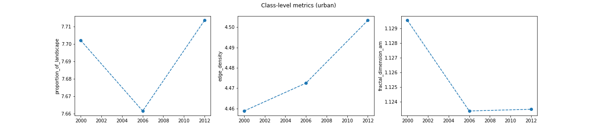

[](https://pypi.python.org/pypi/pylandstats/)
[](https://anaconda.org/conda-forge/pylandstats)
[](https://pylandstats.readthedocs.io/en/latest/?badge=latest)
[](https://github.com/martibosch/pylandstats/blob/main/.github/workflows/tests.yml)
[](https://results.pre-commit.ci/latest/github/martibosch/pylandstats/main)
[](https://codecov.io/github/martibosch/pylandstats)
[](https://github.com/martibosch/pylandstats/blob/master/LICENSE)

# PyLandStats

Open-source library to compute landscape metrics in the Python ecosystem (NumPy, pandas, matplotlib...)

**Citation**: Bosch M. 2019. "PyLandStats: An open-source Pythonic library to compute landscape metrics". *PLOS ONE, 14(12), 1-19*. [doi.org/10.1371/journal.pone.0225734](https://doi.org/10.1371/journal.pone.0225734)

## Features

- Read GeoTiff files of land use/cover:

  ```python
  import pylandstats as pls

  ls = pls.Landscape("../data/processed/veveyse-AS18_4.tif")
  ls.plot_landscape(legend=True)
  ```

  

- Compute pandas data frames of landscape metrics at the patch, class and landscape level:

  ```python
  class_metrics_df = ls.compute_class_metrics_df(
      metrics=["proportion_of_landscape", "edge_density", "euclidean_nearest_neighbor_mn"]
  )
  class_metrics_df
  ```

  | class_val | proportion_of_landscape | edge_density | euclidean_nearest_neighbor_mn |
  | --------: | ----------------------: | -----------: | ----------------------------: |
  |         1 |                7.749572 |    19.102211 |                    309.244705 |
  |         2 |               56.271868 |    50.599270 |                    229.079970 |
  |         3 |               33.946252 |    38.167200 |                    253.299859 |
  |         4 |                2.032308 |     3.722177 |                    552.835154 |

- Analyze the spatio-temporal evolution of landscapes:

  ```python
  import matplotlib.pyplot as plt

  input_filepaths = [
      "../data/processed/veveyse-AS97R_4.tif",
      "../data/processed/veveyse-AS09R_4.tif",
      "../data/processed/veveyse-AS18_4.tif",
  ]

  sta = pls.SpatioTemporalAnalysis(input_filepaths, dates=["1992", "2004", "2012"])
  sta.plot_metric("contagion")
  ```

  

- Zonal analysis of landscapes

See the [documentation](https://pylandstats.readthedocs.io/en/latest/?badge=latest) and the [pylandstats-notebooks](https://github.com/martibosch/pylandstats-notebooks) repository for a more complete overview.

## Installation

The easiest way to install PyLandStats is with conda:

```
$ conda install -c conda-forge pylandstats
```

which will install PyLandStats and all of its dependencies. Alternatively, you can install PyLandStats using pip:

```
$ pip install pylandstats
```

Nevertheless, note that in order to define zones by vector geometries in `ZonalAnalysis`, or in order to use the the `BufferAnalysis` and `SpatioTemporalBufferAnalysis` classes, PyLandStats requires [geopandas](https://github.com/geopandas/geopandas), which cannot be installed with pip. If you already have [the dependencies for geopandas](https://geopandas.readthedocs.io/en/latest/install.html#dependencies) installed in your system, you might then install PyLandStats with the `geo` extras as in:

```
$ pip install pylandstats[geo]
```

and you will be able to use the aforementioned features (without having to use conda).

### Development install

To install a development version of PyLandStats, you can first use conda to create an environment with all the dependencies and activate it as in:

```
$ conda create -n pylandstats -c conda-forge geopandas matplotlib-base rasterio scipy openblas
$ conda activate pylandstats
```

and then clone the repository and use pip to install it in development mode

```
$ git clone https://github.com/martibosch/pylandstats.git
$ cd pylandstats/
$ pip install -e .
```

## Acknowledgments

- The computation of the adjacency matrix in [transonic](https://github.com/fluiddyn/transonic) has been implemented by Pierre Augier ([paugier](https://github.com/paugier))
- Several information theory-based metrics from Nowosad and Stepinski \[1\] were added by [achennu](https://github.com/achennu)
- With the support of the École Polytechnique Fédérale de Lausanne (EPFL)
- The Corine Land Cover datasets used for the test datasets were produced with funding by the European Union

## References

1. Nowosad, J., & Stepinski, T. F. (2019). Information theory as a consistent framework for quantification and classification of landscape patterns. Landscape Ecology, 34(9), 2091-2101.
